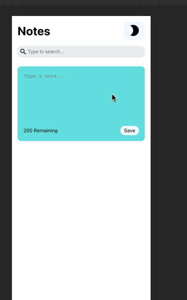

# Notes React App

This project was done to develop my skills and grow my knowledge with the React framework

# About the Author

Name: Samira Mc Queen
[LinkedIn](https://www.linkedin.com/in/samira-mc-queen-1882431a7/)

Free Spririted Caribbean Woman.
Software Developer and aspiring Game Developer

# Project 

## Experience with Project

- The experience with this project was very thrilling
- It taught me a few more things in React which I can implement in my upcoming projects

# Application Features

- User can create a new note
- User is able to delete a note
- User notes stores in the local storage
- User has the preference of dark or light mode
- User is able to search through created notes

# Frontend Built With

- React
- Material Design

# Project setup

Once the project is downloaded locally on your device do the following:
`
npm install
`

If there are dependencies that need updating or you want to check:
`
npm outdated
`

If there are outdated dependencies:
`
npm update
`

To check and update packages in package.json:
`
npx npm-check-updates -u
`

# Getting Started with Create React App

This project was bootstrapped with [Create React App](https://github.com/facebook/create-react-app).

## Available Scripts

In the project directory, you can run:

### `yarn start`

Runs the app in the development mode.\
Open [http://localhost:3000](http://localhost:3000) to view it in the browser.

The page will reload if you make edits.\
You will also see any lint errors in the console.
